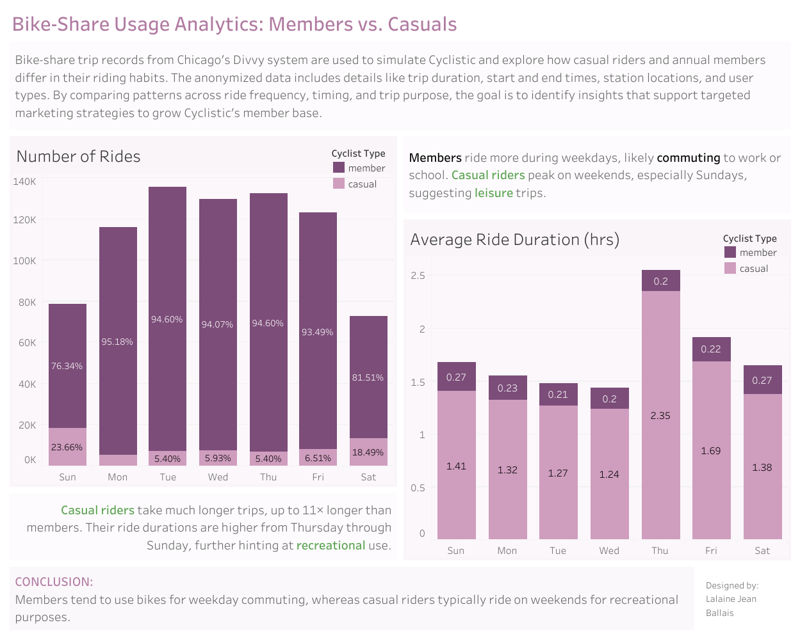

# Bike-Share Usage Analytics: Members vs Casuals

Anonymized bike-share data from Chicago's Divvy system is used to simulate Cyclistic data, allowing for a comparison of casual riders and annual members. The analysis explores trip duration, timing, and usage patterns to uncover insights that inform targeted marketing strategies for Cyclistic.

Take a look at the jupyter notebook [**cyclistic_analysis.ipynb**](https://github.com/laballais/cyclistic_analysis/blob/main/cyclistic_analysis.ipynb) to see how the data was cleaned and processed for analysis using *R*.

For data visualization, Tableau was used. Data visualization for this case study may be accessed in [my tableau profile](https://public.tableau.com/views/CyclisticPortfolio/Dashboard1?:language=en-US&:sid=&:redirect=auth&:display_count=n&:origin=viz_share_link) or shown in the image below.

